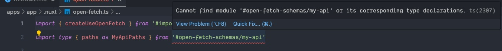

# nuxt-monorepo-reproductions

**Monorepo** reproductions for Nuxt

## Steps to reproduce

1. Clone this repo.
2. Check out the `test/nuxt-open-fetch-types` branch.
3. Install dependencies from the root with `pnpm install`
4. From the root, run the `prepare` command recursively for each package: `pnpm -r prepare`
5. From the root, build the `app` that extends the `core` layer: `pnpm -F app build`
6. Inspect the generated `apps/app/.nuxt/tsconfig.json` and you will notice it only creates a single `alias` entry (should be around line `80`):

   ```typescript
    "#open-fetch-schemas": [
      "./types/open-fetch/schemas"
    ],
   ```

7. Inspect the `apps/app/.nuxt/open-fetch.ts` file and notice that TypeScript cannot find the module for the `#open-fetch-schemas/my-api` import on line `2`.

   
